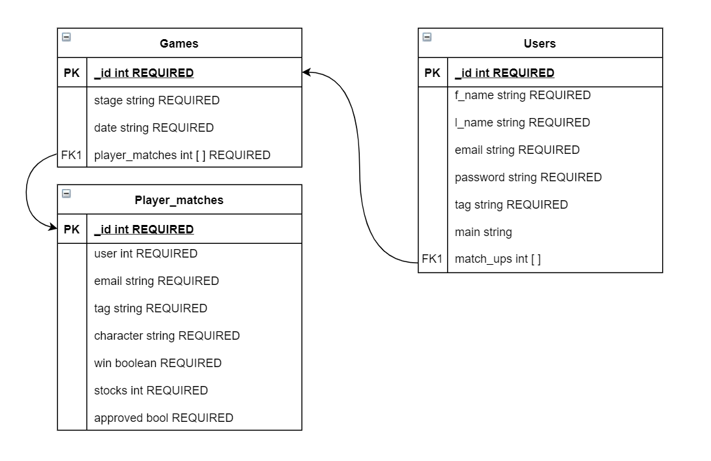

# Server
REST API that powers the backend.
It is powered by [Flask](https://flask.palletsprojects.com/en/1.1.x/), [Python](https://www.python.org/), and [MongoDB](https://www.mongodb.com/).

## Entity Relationship Diagram

